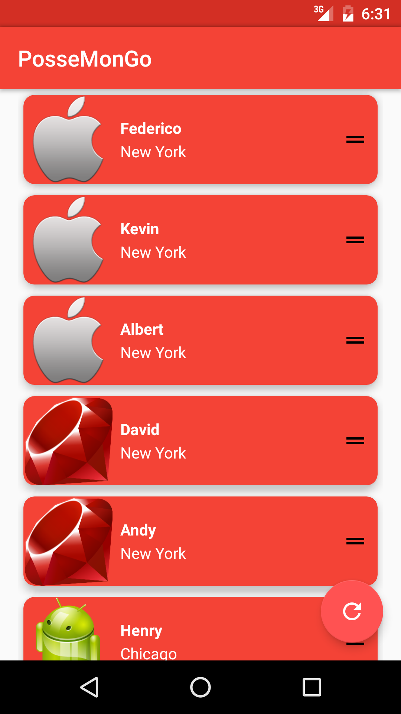
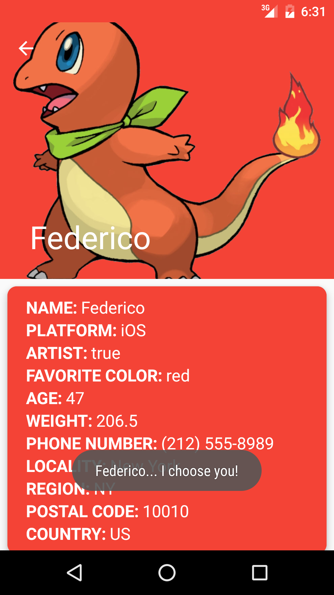
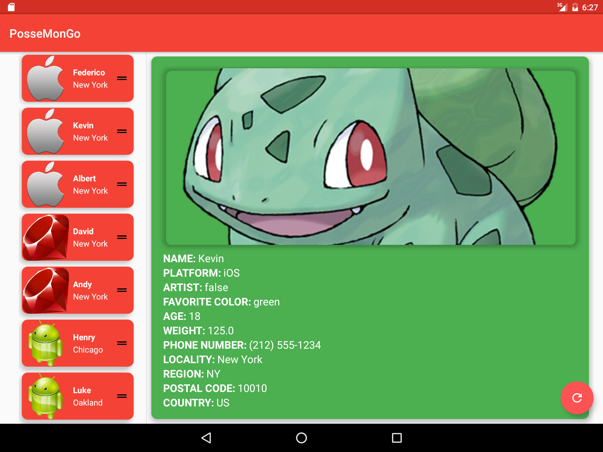

# **Application: PosseMonGo**
## **Developer: Mike Kwon**
## **Contact: Kwondeveloper@gmail.com**

---

### Overview
In honor of the rise & fall of PokemonGo, and the fact that using Posse's branding on the app reminded me of a Pokedex app my buddy created...

####Leverages:
-GSON 3rd Party Library
-Picasso 3rd Party Library
-Google Support Library
-Singleton Design Pattern
-Material Design (RecyclerView, CardView)
-Multi-Threading via AsyncTask
-Master/Detail Flow tablet layout enabled via Fragments

---